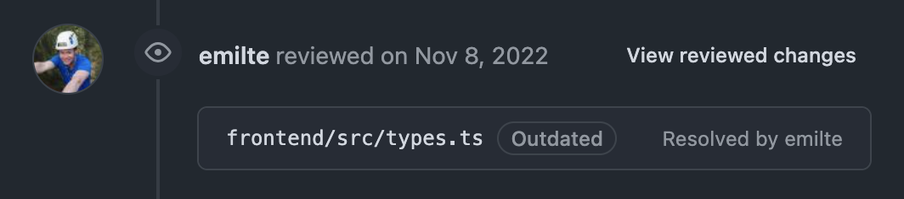

# github-pr-resolved-by
Chrome extension to highlight which user resolved a conversation on pull request.

 

## How to
1. Clone repo `git clone git@github.com:emilte/github-pr-resolved-by.git`
2. Go to `chrome://extensions`
3. Click button `Load unpacked`
4. Select this repo

 
 

## Preview

